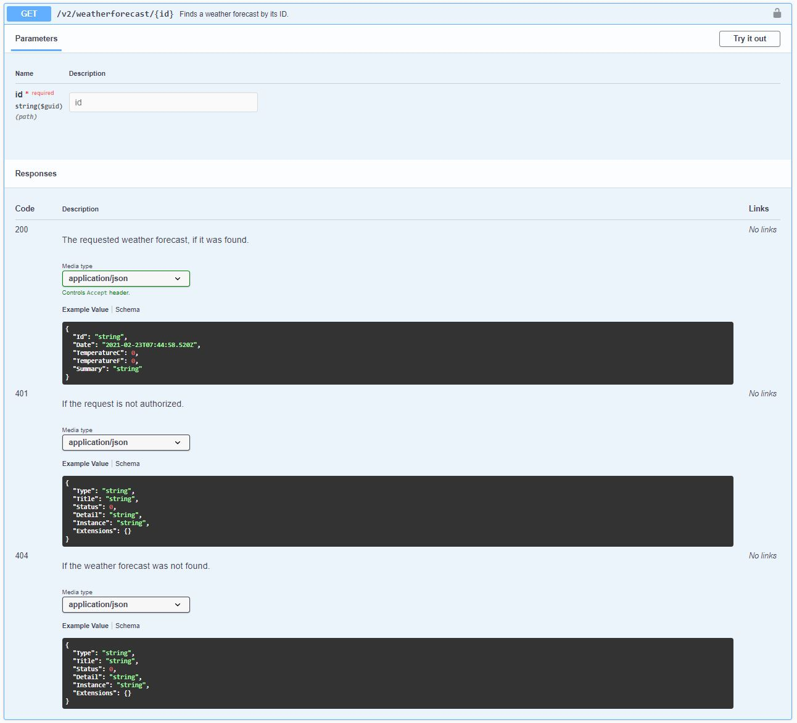

# How to make the computer generate API client code, so that you don't have to

Writing REST API clients is a boring process - espcially when you author (or integrate with) a lot of REST APIs.
It is also expensive when you work in an organization that has multiple teams consuming the same internal services,
with each team spending the same time and effort to independently create their own API clients. The motivation for
this repository is to demonstrate a better approach, where the team responsible for a web service instead uses code
generation tools to generate an API client for the service. A natural progression of this (not demonstrated here)
is to publish the client as a nuget package during the build process.

This repository demonstrates:

* Generating clients using the nswag toolchain (obtained via npm)
* Generating clients using the NSwag.MSBuild package
* *Generating clients for services using Swashbuckle for their API documentation* (todo - only partially working)
* Generating clients for services using NSwag for their API documentation
* Generating clients for services that use API versioning
* Some of the different ways to customize the way documentation is incorporated into your Swagger docs and the
generated client

## Options for generating the client

A convenient approach to generating the client is to install the NSwag.MSBuild package and configure an `AfterBuild`
event in the project file. If you would prefer not to do this (e.g. because you don't want to slow your builds down)
then you could use something like the toolchain downloadable via npm. The examples in this repository combine the
`aspNetCoreToOpenApi` document generator and the `openApiToCSharpClient` code generator to produce a working C# client.
This will only work if you are using NSwag for your OpenAPI documentation in your API project; if you are using
Swashbuckle then you will need to replace the document generator with the Swashbuckle CLI, and point NSwag at that instead.

### 1. Generating the client with npm

You will need to install npm and the nswag package (`npm install nswag`). From here you can run the following command
to generate the client:

```cmd
nswag run /runtime:<netversion> <path-to-nswag-json>
```

* `netversion` is your .NET Core version (see [here](https://github.com/RicoSuter/NSwag/wiki/NSwag.MSBuild) for the full
list of supported runtimes). An example is NSwagExe_Net50 for .NET 5.
* You could use one of the various command line arguments instead of the nswag.json file if preferred. I prefer the nswag.json
file as it is less awkward to work with as your list of customizations grows.

See [here](nswag-toolchain) for a working example. If you want to try it out as-is:

```cmd
cd nswag-toolchain
npm install
npm run generate
```

### 2. Generating the client with NSwag.MSBuild when using NSwag

This approach involves installing the NSwag.MSBuild package and adding an `AfterBuild` target to your csproj. You have
two options for where to put this; you can either add it to your API project, or to the client project that owns the
generated client code. I opted for the latter in this example, as I didn't want to mix service code with client generation
code (nswag.json) or slow down API project builds with an additional build step.

One way you could approach this is to place an nswag.json configuration file as content somewhere inside the client
project (see [here](nswag-example/src/WeatherForecastApi.Client/nswag.json)) and then configure the build step in your
csproj:

```xml
  <Target Name="NSwag" AfterTargets="AfterBuild">
    <Exec ContinueOnError="true" ConsoleToMSBuild="true" Command="$(NSwagExe_Net50) run nswag.json">
      <Output TaskParameter="ExitCode" PropertyName="NSwagExitCode" />
      <Output TaskParameter="ConsoleOutput" PropertyName="NSwagOutput" />
    </Exec>
    <Message Text="$(NSwagOutput)" Condition="'$(NSwagExitCode)' == '0'" Importance="low" />
    <Error Text="$(NSwagOutput)" Condition="'$(NSwagExitCode)' != '0'" />
  </Target>
```

The `Output` tags are nice to haves that are used in the `Message` and `Error` elements where we report unsuccessful
builds to the Error List window. Without these you would have to go hunting around in the debug logs to find the logs
for build failures. If you would prefer client generation failures to fail the entire build, just change `ContinueOnError`
to false.

### 3. Generating the client when using Swashbuckle

Todo - generate the document using Swashbuckle CLI (preferably as an AfterBuild step) and configure NSwag to pick it up
and create a client from it. Methods are probably not going to be as nicely named as they are with NSwag

## Generating clients when using API versioning

The samples in this codebase demonstrate both one approach to implementing API versioning and how to support these
different versions in your documentation, and consequently, any clients you generate. 

### Adding API versioning

Install the Microsoft.AspNetCore.Mvc.Versioning package, then add this to `ConfigureServices` in Startup.cs:

```csharp
services.AddApiVersioning(options =>
{
    options.RegisterMiddleware = true;
}); 
```

The `RegisterMiddleware` flag will save you from having to also register the service in the `Configure` method.

### Adding versioning support to the API explorer

This is necessary in order to support dynamically registering different API versions with whatever Swagger library
you're using, as opposed to having to manually register each version. If you don't want to register API versions
this way, or if you aren't using API versioning, then you can skip this.

Install the Microsoft.AspNetCore.Mvc.Versioning.ApiExplorer package, then add this to `ConfigureServices` in Startup.cs:

```csharp
services.AddVersionedApiExplorer();
```

### NSwag example

If you are using the versioned API explorer and would prefer not to register each of your versions manually, you could
do something like this:

```csharp
var versionDescriptionProvider = services.BuildServiceProvider().GetRequiredService<IApiVersionDescriptionProvider>();
foreach (var versionDescription in versionDescriptionProvider.ApiVersionDescriptions)
{
    services.AddOpenApiDocument(document =>
    {
        document.DocumentName = versionDescription.GroupName;
        document.ApiGroupNames = new[] { versionDescription.ApiVersion.ToString() };
        document.Title = "Weather Forecast API";
        document.Description = "This API returns weather forecast information";
        document.IgnoreObsoleteProperties = true;
        document.SerializerSettings = new JsonSerializerSettings { ContractResolver = new DefaultContractResolver() };
    });
}
```

Note that the use of the service provider as a service locator on the first line will trigger a warning
(see [here](https://aka.ms/AA5k895)). I haven't tried fixing it, but will update this sample if I find the time to try.

If you would prefer to register versions manually (e.g. because you have different authentication schemes across different
versions of your API), then the approach demonstrated below may fit better.

```csharp
services.AddOpenApiDocument(document =>
{
    document.DocumentName = "v1";
    document.ApiGroupNames = new[] { "1" };
    document.Title = "Weather Forecast API";
    document.Description = "This API returns weather forecast information";
    document.Version = "v1";
    document.IgnoreObsoleteProperties = true;
});
services.AddOpenApiDocument(document =>
{
    document.DocumentName = "v2";
    document.ApiGroupNames = new[] { "2" };
    document.Title = "Weather Forecast API";
    document.Description = "This API returns weather forecast information";
    document.Version = "v2";
    document.IgnoreObsoleteProperties = true;

    document.OperationProcessors.Add(new OperationSecurityScopeProcessor("JWT"));
    document.AddSecurity("JWT", Enumerable.Empty<string>(),
        new OpenApiSecurityScheme
        {
            Type = OpenApiSecuritySchemeType.ApiKey,
            Name = nameof(Authorization),
            In = OpenApiSecurityApiKeyLocation.Header,
            Description = "Field should be in this format: \nBearer {my token}"
        }
    );
});
```

Finally, to ensure your generated API clients support all of the available versions of your API,, you may want to generate a document
that covers all of your API versions. In this example we're adding a version called "all", and targeting said version in the nswag.json
configuration.

In `ConfigureServices` in Startup.cs

```csharp
services.AddOpenApiDocument(document =>
{
    document.DocumentName = "all";
    document.Version = "all";
    document.Title = "Weather Forecast API";
    document.Description = "Weather Forecast API";
});
```

In the nswag.json file:

```json
{
  "runtime": "Net50",
  "defaultVariables": null,
  "documentGenerator": {
    "aspNetCoreToOpenApi": {
      "project": "...",
        "documentName": "all",
     }
  },
  "codeGenerators": {
    "openApiToCSharpClient": {
      ...
    }
  }
}
```

## Supporting deployment of the generated client code as a nuget package

If you want to make the generated client available as a nuget package, then the nswag tooling isn't enough on its own. In this
example I've configured nswag to save the generated client code to the root directory of an existing .NET Standard project. Note
that the code may not build without manual intervention, i.e. installing any missing packages the generated code expects. In my
case, to get these examples to work I needed to install Newtonsoft.Json myself. Example contents of a csproj file:

```xml
<Project Sdk="Microsoft.NET.Sdk">

  <PropertyGroup>
    <TargetFramework>netstandard2.0</TargetFramework>
  </PropertyGroup>

  <ItemGroup>
    <PackageReference Include="Newtonsoft.Json" Version="12.0.3" />
  </ItemGroup>

</Project>
```

## Avoiding bad client configuration like methods called Get2Async

NSwag picks up client class/interface name from the name of your controller. Likewise, method names come from the name of the
action on the controller. If you are following a convention like `Controllers/Vx/UsersController`, and you have two versions
of `UsersController`, then NSwag will only generate a single interface. If there is an action on each called `Get`, you will
end up with `GetAsync` and `Get2Async` in your generated client. If you don't want this and would prefer to see `IUsersClientV1`
and `IUsersClientV2`, with a single `GetAsync` on each, you will need to name your controllers `UsersV1Controller` and
`UsersV2Controller`. There might be a way around this, i.e. by configuring nswag.json, but I haven't tried.

## Improving the documentation of what request and response schema

The example below demonstrate how you can produce significantly richer documentation, which is helpful for both consumers of
your Swagger documentation and consumers of your generated client code (thanks to the inclusion of this documentation as
XML comments on interface members).

In the following examples you will see that:

* The `ProducesResponseType` annotation can be used to report both status codes and the response schema for responses bearing that status code
* XML comments can be used to add context to documented status code results

```csharp
/// <summary>
///     Finds a weather forecast by its ID.
/// </summary>
/// <response code="200">The requested weather forecast, if it was found.</response>
/// <response code="401">If the request is not authorized.</response>
/// <response code="404">If the weather forecast was not found.</response>
[HttpGet("{id}", Name = nameof(GetById))]
[ProducesResponseType(typeof(WeatherForecast), StatusCodes.Status200OK)]
[ProducesResponseType(typeof(ProblemDetails), StatusCodes.Status401Unauthorized)]
[ProducesResponseType(typeof(ProblemDetails), StatusCodes.Status404NotFound)]
public async Task<ActionResult<WeatherForecast>> GetById([FromRoute]Guid id)
{
    // removed for brevity
}
```

This generates the following Swagger documentation:



And the following client code:

```csharp
public partial interface IWeatherForecastVClient
{
    /// <summary>Finds a weather forecast by its ID.</summary>
    /// <returns>The requested weather forecast, if it was found.</returns>
    /// <exception cref="WeatherForecastApiException">A server side error occurred.</exception>
    System.Threading.Tasks.Task<WeatherForecast> GetByIdAsync(System.Guid id);
}
```

### Capturing XML documentation in NSwag

Just add the following to your csproj:

```xml
    <PropertyGroup>
        <TargetFramework>net5.0</TargetFramework>
    </PropertyGroup>

    <PropertyGroup Condition="'$(Configuration)|$(Platform)'=='Debug|AnyCPU'">
      <DocumentationFile>obj\debug\net5.0\WeatherForecastApi.xml</DocumentationFile>
    </PropertyGroup>

    <PropertyGroup Condition="'$(Configuration)|$(Platform)'=='Release|AnyCPU'">
      <DocumentationFile>obj\release\net5.0\WeatherForecastApi.xml</DocumentationFile>
    </PropertyGroup>
```

You can also access settings for the documentation files by right-clicking on the project in solution explorer,
selecting Properties, then navigating to the Build tab.

You don't need to do anything special to get NSwag to pick your XML docs up beyond ensuring the project system
actually generates them, and ensuring that the file name matches the assembly name.

## Further reading

* [GitHub source code for the code gen tooling](https://github.com/RicoSuter/NSwag)
* [NPM package used in this example](https://www.npmjs.com/package/nswag)
